# 🏗️ System Architecture - Aldersbach Monastery Dashboard

## 📋 Architecture Overview

The Aldersbach Monastery Financial Dashboard follows a **client-side, single-page application (SPA)** architecture designed for maximum compatibility, offline capability, and research workflow optimization.

### Design Principles
- **Offline-First:** All processing happens in the browser
- **No Dependencies:** Minimal external library dependencies
- **Performance-Focused:** Optimized for large historical datasets
- **Research-Oriented:** Built specifically for academic workflows
- **Accessibility-First:** Universal access to historical data

## 🎯 High-Level Architecture

```mermaid
graph TB
    User[👤 Researcher] --> UI[🖥️ User Interface]
    UI --> Core[⚙️ Core Application]
    Core --> DataLayer[📊 Data Processing Layer]
    Core --> VizLayer[📈 Visualization Layer]
    Core --> ExportLayer[📤 Export Layer]
    
    DataLayer --> Parser[🔍 XML Parser]
    DataLayer --> Search[🔎 Search Engine]
    DataLayer --> Cache[💾 Client Cache]
    
    VizLayer --> Charts[📊 Chart.js]
    VizLayer --> D3[🕸️ D3.js Networks]
    VizLayer --> Canvas[🎨 Canvas Rendering]
    
    ExportLayer --> CSV[📄 CSV Generator]
    ExportLayer --> PDF[📑 PDF Reports]
    ExportLayer --> JSON[⚡ JSON Export]
    
    Files[📁 RDF/XML Files] --> DataLayer
    LocalStorage[💿 Browser Storage] --> Cache
```



## 🧩 Component Architecture

### 1. User Interface Layer

#### 1.1 Dashboard Shell
**Responsibility:** Main application container and navigation
```javascript
class Dashboard {
  constructor() {
    this.header = new HeaderComponent();
    this.sidebar = new SidebarComponent();
    this.main = new MainContentArea();
    this.modal = new ModalManager();
  }
}
```

**Components:**
- **HeaderComponent:** Title, file selection, global controls
- **SidebarComponent:** Filters, search, navigation
- **MainContentArea:** Data table, charts, analysis views
- **ModalManager:** Transaction details, settings, help

#### 1.2 Control Components
**Responsibility:** User input and interaction management

```javascript
// Filter Panel Architecture
class FilterPanel {
  constructor(dataManager) {
    this.dataManager = dataManager;
    this.filters = {
      search: new SearchFilter(),
      date: new DateRangeFilter(),
      currency: new CurrencyFilter(),
      amount: new AmountRangeFilter(),
      entity: new EntityFilter()
    };
  }
  
  applyFilters() {
    const combinedFilter = this.combineFilters();
    this.dataManager.setFilter(combinedFilter);
  }
}

// Individual Filter Components
class SearchFilter extends BaseFilter {
  constructor() {
    super('search');
    this.searchEngine = new SearchEngine();
  }
  
  apply(transactions, query) {
    return this.searchEngine.search(transactions, query);
  }
}
```

### 2. Data Processing Layer

#### 2.1 Data Manager
**Responsibility:** Central data orchestration and state management

```javascript
class DataManager {
  constructor() {
    this.rawData = null;           // Original XML data
    this.transactions = [];        // Parsed transactions
    this.filteredData = [];        // Currently filtered view
    this.cache = new DataCache();  // Performance optimization
    this.observers = [];           // Observer pattern for updates
  }
  
  async loadFile(file) {
    this.rawData = await this.fileLoader.load(file);
    this.transactions = await this.parser.parse(this.rawData);
    this.cache.store('transactions', this.transactions);
    this.notifyObservers('dataLoaded');
  }
  
  setFilter(filterFunction) {
    this.filteredData = this.transactions.filter(filterFunction);
    this.notifyObservers('dataFiltered');
  }
  
  // Observer pattern implementation
  subscribe(callback) {
    this.observers.push(callback);
  }
  
  notifyObservers(event) {
    this.observers.forEach(callback => callback(event, this.filteredData));
  }
}
```

#### 2.2 XML Parser
**Responsibility:** Convert RDF/XML to JavaScript objects

```javascript
class RDFXMLParser {
  parse(xmlString) {
    const parser = new DOMParser();
    const xmlDoc = parser.parseFromString(xmlString, 'text/xml');
    
    return Array.from(xmlDoc.querySelectorAll('bk\\:Transaction, Transaction'))
      .map(this.parseTransaction.bind(this))
      .filter(transaction => transaction.isValid);
  }
  
  parseTransaction(transactionElement) {
    return new Transaction({
      id: this.extractId(transactionElement),
      entry: this.extractEntry(transactionElement),
      date: this.extractDate(transactionElement),
      amounts: this.extractAmounts(transactionElement),
      entities: this.extractEntities(transactionElement),
      rawXML: transactionElement.outerHTML
    });
  }
}

class Transaction {
  constructor(data) {
    this.id = data.id;
    this.entry = data.entry;
    this.date = data.date;
    this.amounts = data.amounts || [];
    this.entities = data.entities || {};
    this.rawXML = data.rawXML;
    this.isValid = this.validate();
  }
  
  validate() {
    return this.entry && this.entry.length > 0;
  }
  
  getTotalFlorinValue() {
    return this.amounts.reduce((total, amount) => {
      return total + CurrencyConverter.toFlorin(amount.value, amount.currency);
    }, 0);
  }
}
```

#### 2.3 Search Engine
**Responsibility:** Full-text search with medieval German support

```javascript
class SearchEngine {
  constructor() {
    this.index = new InvertedIndex();
    this.fuzzyMatcher = new FuzzyMatcher();
    this.germanStemmer = new GermanStemmer();
  }
  
  buildIndex(transactions) {
    transactions.forEach(transaction => {
      const tokens = this.tokenize(transaction.entry);
      tokens.forEach(token => {
        this.index.add(token, transaction.id);
      });
    });
  }
  
  search(query, options = {}) {
    const tokens = this.tokenize(query);
    const results = tokens.map(token => {
      let matches = this.index.get(token) || [];
      
      // Add fuzzy matches for medieval spelling variations
      if (options.fuzzy) {
        matches = matches.concat(this.findFuzzyMatches(token));
      }
      
      // Add stemmed matches for German morphology
      if (options.stemming) {
        const stemmed = this.germanStemmer.stem(token);
        matches = matches.concat(this.index.get(stemmed) || []);
      }
      
      return new Set(matches);
    });
    
    return this.combineResults(results, options.operator || 'AND');
  }
  
  tokenize(text) {
    return text.toLowerCase()
      .replace(/[^\w\säöüß]/g, ' ') // Preserve German characters
      .split(/\s+/)
      .filter(word => word.length > 2);
  }
}
```

### 3. Visualization Layer

#### 3.1 Chart Factory
**Responsibility:** Create and manage different chart types

```javascript
class ChartFactory {
  static createChart(type, container, data, options = {}) {
    switch(type) {
      case 'timeline':
        return new TimelineChart(container, data, options);
      case 'currency-distribution':
        return new CurrencyChart(container, data, options);
      case 'network':
        return new NetworkChart(container, data, options);
      case 'histogram':
        return new HistogramChart(container, data, options);
      default:
        throw new Error(`Unknown chart type: ${type}`);
    }
  }
}

class BaseChart {
  constructor(container, data, options) {
    this.container = container;
    this.data = data;
    this.options = { ...this.getDefaultOptions(), ...options };
    this.chart = null;
  }
  
  render() {
    this.chart = this.createChart();
    this.bindEvents();
    return this.chart;
  }
  
  update(newData) {
    this.data = newData;
    if (this.chart) {
      this.chart.data = this.transformData(newData);
      this.chart.update();
    }
  }
  
  destroy() {
    if (this.chart) {
      this.chart.destroy();
    }
  }
}
```

#### 3.2 Network Visualization
**Responsibility:** Entity relationship visualization with D3.js

```javascript
class NetworkChart extends BaseChart {
  createChart() {
    const width = this.container.clientWidth;
    const height = this.container.clientHeight;
    
    const svg = d3.select(this.container)
      .append('svg')
      .attr('width', width)
      .attr('height', height);
    
    // Create force simulation
    this.simulation = d3.forceSimulation(this.data.nodes)
      .force('link', d3.forceLink(this.data.links).id(d => d.id))
      .force('charge', d3.forceManyBody().strength(-300))
      .force('center', d3.forceCenter(width / 2, height / 2));
    
    // Draw links
    const link = svg.append('g')
      .selectAll('line')
      .data(this.data.links)
      .join('line')
      .attr('stroke', '#999')
      .attr('stroke-width', d => Math.sqrt(d.value));
    
    // Draw nodes
    const node = svg.append('g')
      .selectAll('circle')
      .data(this.data.nodes)
      .join('circle')
      .attr('r', d => Math.sqrt(d.transactionCount) * 2)
      .attr('fill', d => this.getNodeColor(d.type))
      .call(this.drag());
    
    // Labels
    const label = svg.append('g')
      .selectAll('text')
      .data(this.data.nodes)
      .join('text')
      .text(d => d.name)
      .style('font-size', '12px');
    
    // Update positions on simulation tick
    this.simulation.on('tick', () => {
      link.attr('x1', d => d.source.x)
          .attr('y1', d => d.source.y)
          .attr('x2', d => d.target.x)
          .attr('y2', d => d.target.y);
      
      node.attr('cx', d => d.x)
          .attr('cy', d => d.y);
      
      label.attr('x', d => d.x + 10)
           .attr('y', d => d.y + 5);
    });
    
    return { svg, simulation: this.simulation };
  }
}
```

### 4. Export Layer

#### 4.1 Export Manager
**Responsibility:** Coordinate different export formats

```javascript
class ExportManager {
  constructor() {
    this.exporters = {
      csv: new CSVExporter(),
      json: new JSONExporter(),
      pdf: new PDFExporter(),
      png: new ImageExporter()
    };
  }
  
  async export(format, data, options = {}) {
    const exporter = this.exporters[format];
    if (!exporter) {
      throw new Error(`Unsupported export format: ${format}`);
    }
    
    // Add metadata
    const exportData = {
      metadata: {
        exportDate: new Date().toISOString(),
        source: 'Aldersbach Monastery Financial Dashboard',
        recordCount: data.length,
        filters: options.appliedFilters || {}
      },
      data: data
    };
    
    return await exporter.export(exportData, options);
  }
}

class CSVExporter {
  async export(exportData, options) {
    const { data, metadata } = exportData;
    
    // Create CSV headers
    const headers = this.getHeaders(options.includeFields);
    
    // Convert data to CSV rows
    const rows = data.map(transaction => this.transactionToRow(transaction, headers));
    
    // Add metadata as comments
    const metadataComments = this.createMetadataComments(metadata);
    
    const csvContent = [
      ...metadataComments,
      headers.join(','),
      ...rows.map(row => row.join(','))
    ].join('\n');
    
    return this.downloadFile(csvContent, 'aldersbach-export.csv', 'text/csv');
  }
}
```

## 🔄 Data Flow Architecture

### 1. Data Loading Flow
```
User Selects File → File Loader → XML Parser → Transaction Objects → Data Manager → UI Update
                                      ↓
                               Error Handling → User Notification
                                      ↓
                               Progress Updates → Loading Indicator
```

### 2. Search and Filter Flow
```
User Input → Search Engine → Filter Functions → Filtered Dataset → UI Components
    ↓              ↓              ↓                   ↓              ↓
Search Index   Query Parser   Boolean Logic    Result Ranking   Table Update
                                                     ↓              ↓
                                               Chart Update    Pagination Update
```

### 3. Visualization Flow
```
Filtered Data → Data Transformer → Chart Factory → Visualization Library → Rendered Chart
      ↓               ↓                 ↓                    ↓                  ↓
  Aggregation   Format Conversion   Component Selection   Library API    Interactive Elements
```

## 🏗️ Component Dependencies

### Dependency Graph


### External Library Dependencies
- **Chart.js 4.x:** Statistical charts and timelines
- **D3.js 7.x:** Network visualizations and complex interactions
- **jsPDF:** PDF report generation
- **noUiSlider:** Range filter controls

## 🔧 Configuration Architecture

### 1. Application Configuration
```javascript
const AppConfig = {
  performance: {
    maxFileSize: 10 * 1024 * 1024, // 10MB
    maxTransactions: 10000,
    paginationSize: 50,
    searchDebounce: 300
  },
  
  ui: {
    theme: 'medieval',
    responsiveBreakpoints: [320, 768, 1024, 1440],
    animationDuration: 250
  },
  
  data: {
    defaultCurrency: 'f',
    currencyRates: { f: 1, s: 1/30, d: 1/240, gr: 1/20 },
    dateFormats: ['YYYY-MM-DD', 'DD.MM.YYYY'],
    textEncoding: 'UTF-8'
  },
  
  export: {
    csvDelimiter: ',',
    csvEncoding: 'UTF-8-BOM',
    pdfFormat: 'A4',
    imageResolution: 300
  }
};
```

### 2. Feature Flags
```javascript
const FeatureFlags = {
  advancedSearch: true,
  networkVisualization: false, // Enable in Phase 2
  collaborativeFeatures: false,
  offlineMode: true,
  debugMode: process.env.NODE_ENV === 'development'
};
```

## 📱 Responsive Architecture

### Adaptive Component Loading
```javascript
class ResponsiveLoader {
  constructor() {
    this.breakpoints = AppConfig.ui.responsiveBreakpoints;
    this.currentBreakpoint = this.getCurrentBreakpoint();
  }
  
  async loadComponents() {
    if (this.isMobile()) {
      // Load mobile-optimized components
      const { MobileTable } = await import('./components/mobile/MobileTable.js');
      return { table: MobileTable };
    } else {
      // Load desktop components
      const { DesktopTable } = await import('./components/desktop/DesktopTable.js');
      return { table: DesktopTable };
    }
  }
}
```

## 🔒 Security Architecture

### Client-Side Security Measures
```javascript
class SecurityManager {
  validateXMLInput(xmlString) {
    // Prevent XXE attacks
    if (xmlString.includes('<!ENTITY') || xmlString.includes('SYSTEM')) {
      throw new SecurityError('External entities not allowed');
    }
    
    // Size validation
    if (xmlString.length > AppConfig.performance.maxFileSize) {
      throw new SecurityError('File size exceeds limit');
    }
    
    return true;
  }
  
  sanitizeUserInput(input) {
    // Prevent XSS in search and filter inputs
    return DOMPurify.sanitize(input, { ALLOWED_TAGS: [] });
  }
  
  validateExportRequest(format, data) {
    const allowedFormats = ['csv', 'json', 'pdf'];
    if (!allowedFormats.includes(format)) {
      throw new SecurityError(`Invalid export format: ${format}`);
    }
    
    if (data.length > AppConfig.performance.maxTransactions) {
      throw new SecurityError('Export size exceeds limit');
    }
    
    return true;
  }
}
```

## 🧪 Testing Architecture

### Test Structure
```
tests/
├── unit/
│   ├── data/
│   │   ├── XMLParser.test.js
│   │   ├── SearchEngine.test.js
│   │   └── CurrencyConverter.test.js
│   ├── ui/
│   │   ├── FilterPanel.test.js
│   │   └── TransactionTable.test.js
│   └── export/
│       ├── CSVExporter.test.js
│       └── PDFExporter.test.js
├── integration/
│   ├── DataLoadingFlow.test.js
│   ├── SearchAndFilter.test.js
│   └── ExportWorkflow.test.js
├── e2e/
│   ├── UserJourneys.test.js
│   └── PerformanceTests.test.js
└── fixtures/
    ├── sample-data.xml
    ├── large-dataset.xml
    └── malformed-data.xml
```

---

**Architecture Review:** Quarterly architecture review cycles
**Scalability:** Designed for 10,000+ transactions with 50+ concurrent users
**Maintainability:** Modular design with clear separation of concerns
**Performance:** Sub-3-second load times for typical datasets